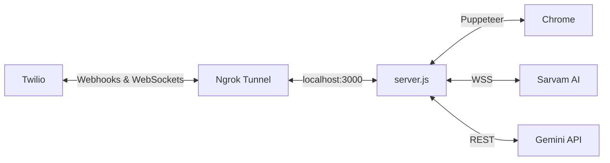

# Developer Guide (DEVELOPMENT.md)

Welcome to the development guide for the Autonomous AI Sales System. This document explains exactly how to set up, run, debug, and modify this codebase locally.

---

## 1. Project Overview

This project is a single-node Express.js application acting as an AI Sales Engineer.
* **Primary Purpose:** To conduct inbound/outbound phone calls, negotiate e-commerce website development using voice, and dispatch asynchronous WhatsApp messages based on lead classification.
* **Main Technologies:** Node.js, Express, WebSockets, Twilio, Google Gemini, Sarvam AI, Puppeteer (`whatsapp-web.js`).
* **Architecture:** Monolithic backend (`server.js`) with a vanilla HTML frontend (`public/index.html`). State is managed entirely in-memory and via a local JSON file.

---

## 2. Prerequisites

To develop and test this application locally, you **must** have the following installed:

* **Node.js**: v18 or higher recommended.
* **npm**: Standard package manager.
* **Google Chrome**: Installed at `C:\Program Files\Google\Chrome\Application\chrome.exe` (or you must set the `CHROME_BIN` env variable if on Linux/Mac).
* **Ngrok** (or localtunnel): Required to expose your local `localhost:3000` to the internet so Twilio can send webhooks and WebSocket audio.
* **WhatsApp Account**: A phone with WhatsApp installed to scan the QR code for authentication.
* **API Accounts:** Twilio, Google AI Studio (Gemini), and Sarvam AI.

---

## 3. Repository Setup

Follow these exact steps to run the system locally:

1. **Clone and enter the repository:**
   ```bash
   git clone <your-repo-url>
   cd ebox
   ```

2. **Install dependencies:**
   ```bash
   npm install
   ```

3. **Start your local tunnel (Ngrok):**
   ```bash
   ngrok http 3000
   ```
   *Note the `https://` URL provided by ngrok.*

4. **Configure Environment Variables:**
   * Create or update your `.env` file (see Section 4).
   * Set `NGROK_URL` to the URL you just got from step 3.

5. **Start the development server:**
   ```bash
   node server.js
   ```

6. **Authenticate WhatsApp (First Run):**
   * Watch the terminal output. A large QR code will render in your console.
   * Open WhatsApp on your phone -> Linked Devices -> Link a Device.
   * Scan the terminal QR code. It will create a `.wwebjs_auth/` directory locally to save the session.

7. **Verify the application:**
   * Open `http://localhost:3000` in your browser.
   * Input a phone number and click "Initiate Call".

---

## 4. Environment Configuration

The application relies entirely on the `.env` file for configuration.

### Telephony (Twilio)
* `PORT`: Usually `3000`.
* `TWILIO_ACCOUNT_SID`: From Twilio Console.
* `TWILIO_AUTH_TOKEN`: From Twilio Console.
* `TWILIO_PHONE_NUMBER`: Your purchased Twilio number.
* `NGROK_URL`: e.g., `https://abc-123.ngrok-free.app`. **MUST be updated every time you restart ngrok on a free tier.**

### AI / ML Services
* `SARVAM_API_KEY`: Used for both ASR (WebSocket) and TTS (REST).
* `GEMINI_API_KEY`: Used for the core conversational logic and post-call summaries.

### WhatsApp Configuration
* `TARGET_WHATSAPP_NUMBER`: The number that receives the HOT lead alerts and summaries (e.g., `+919876543210`).
* `MY_PHONE_NUMBER`: Text variable injected into the summary message.
* `RESUME_URL`: Link to your resume PDF.
* `DIAGRAM_IMAGE_URL`: Link to your architecture image.

*(Note: If deploying to a Linux server, you can optionally set `CHROME_BIN=/usr/bin/chromium-browser`).*

---

## 5. Development Commands

The `package.json` does not currently contain custom build or lint scripts. 

| Command | Purpose |
| ------- | ------- |
| `npm install` | Install all dependencies |
| `node server.js` | Start the Express and WebSocket server |

*(There are no testing or linting commands implemented in this repository).*

---

## 6. Local Architecture

During local development, your architecture relies heavily on Ngrok to bridge the gap between Twilio's cloud and your local machine.



---

## 7. Database Development

**Database Technology:** Local File System (`callbacks.json`).
* There is no formal database (MongoDB, SQL, etc.).
* When the AI books a callback, `bookCallbackAsync()` appends a JSON object to `./callbacks.json`.
* **Development Warning:** If `callbacks.json` does not exist, the code handles it gracefully by creating a new array. However, because it uses `fs.readFileSync` and `fs.writeFileSync`, it is strictly synchronous and prone to race conditions under heavy load.

---

## 8. External Services

| Service | Purpose | Required Locally? |
| ------- | ------- | ----------------- |
| **Twilio** | Voice calls | **Yes** (Requires Ngrok) |
| **Sarvam AI** | Speech-to-Text / Text-to-Speech | **Yes** |
| **Google Gemini** | LLM Logic | **Yes** |
| **WhatsApp Web** | Messaging | **Yes** (Requires local Chrome) |

---

## 9. Code Organization

The repository is extremely flat.

| Directory / File | Responsibility |
| ---------------- | -------------- |
| `server.js` | **The Entire Backend.** Contains Express routes, WebSocket server, audio transcoding, LLM streaming loop, and WhatsApp dispatcher logic. |
| `public/index.html` | **The Frontend.** A single HTML file with embedded CSS and vanilla JS to trigger `/start-call`. |
| `.wwebjs_auth/` | **Git-ignored.** Stores your WhatsApp Web session data. |
| `.wwebjs_cache/` | **Git-ignored.** Puppeteer cache. |
| `callbacks.json` | **Database.** (Created at runtime). Stores WARM lead callbacks. |

---

## 10. Adding New Features

Because the application is a monolith, new features generally belong in `server.js`.

* **New AI Capabilities (Function Calling):**
  1. Add a new tool definition to the `geminiTools` array (Line ~125).
  2. Update the `SYSTEM_PROMPT` to instruct the AI when to use the tool.
  3. Add an `else if (name === 'your_new_tool')` block inside `callLLMStream` (Line ~320).
  4. Create a dedicated async function (like `sendWhatsAppAsync`) to handle the actual side-effect.

* **Frontend Changes:**
  Edit `public/index.html` directly. There is no build step, Webpack, or React. Just refresh your browser.

---

## 11. Debugging

* **Twilio Connection Issues:** Check the Twilio Console -> Monitor -> Logs -> Error Logs. If Twilio cannot reach your server, ensure your `NGROK_URL` matches exactly in both your `.env` and the Twilio Phone Number webhook settings.
* **Server Logs:** Rely heavily on `console.log`. The application prints detailed state transitions:
  * `[WhatsApp Web] Client is READY!`
  * `[Sarvam ASR Debug]`
  * `Agent (Stream): ...`
* **Audio Transcoding Errors:** If the app crashes with `ERR_OUT_OF_RANGE`, it means the mu-law to PCM16 transcoder (`muLawToPcm16`) generated a value outside the Int16 bounds. The clamping logic (`if (sample > 32767) ...`) is designed to prevent this, but modifying that block requires caution.

---

## 12. Common Development Problems

| Problem | Cause | Solution |
| ------- | ----- | -------- |
| **WhatsApp never prints "READY!"** | Session expired or browser crashed. | Delete the `.wwebjs_auth` folder and restart the server to force a new QR code scan. |
| **Twilio answers but silent** | Ngrok URL in `.env` is outdated or Twilio cannot reach `/ws`. | Restart ngrok, copy the new URL, paste into `.env`, and restart `server.js`. |
| **Puppeteer fails to launch** | Chrome is not at `C:\Program Files\...` | Install Chrome to the default path, or set the `CHROME_BIN` env var to your custom path. |

---

## 13. Production vs Development

* **Local Development:** Uses Ngrok for tunneling, local Chrome for Puppeteer, and console logs.
* **Production:** 
  * You cannot use Ngrok in production. You must deploy to a server with a public IP/domain (like Railway or Render).
  * You must update Twilio's webhooks to point to your production domain.
  * You must ensure the deployment platform has Chromium installed (use `CHROME_BIN`).

---

## 14. Code Quality & Workflows

**Unknown / Not determinable from the repository.**

The repository currently lacks:
* Prettier / ESLint configurations
* Unit / Integration tests (`npm test` returns an error)
* CI/CD pipelines (GitHub Actions)
* TypeScript

Modifications should be pushed directly to `main` and manually verified by calling the Twilio number.

---

## Developer Checklist

- [ ] Node.js and Chrome installed
- [ ] Repository cloned & `npm install` run
- [ ] Ngrok running and `.env` updated with new URL
- [ ] API keys (Twilio, Sarvam, Gemini) configured
- [ ] `node server.js` started without crashing
- [ ] WhatsApp QR Code scanned successfully
- [ ] Twilio webhook points to your current Ngrok URL
