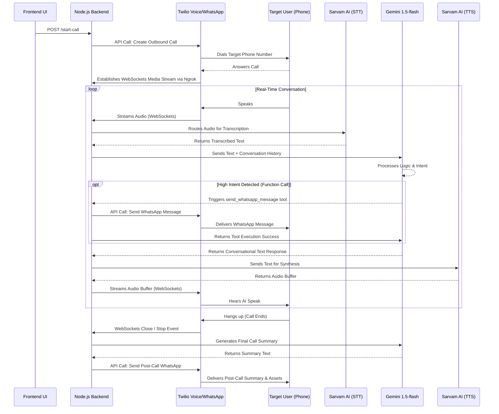

# AI-Automated Recruiter Agent: System Architecture & Data Flow

## System Architecture Components

The AI-Automated Recruiter Agent is a real-time conversational voice bot designed to conduct screening calls and perform mid-call and post-call automated actions. The architecture is composed of the following core technologies:

- **Backend (Node.js / Express):** Acts as the central orchestrator. It serves the frontend UI, exposes REST endpoints for call initiation, and manages the real-time WebSocket bidirectional data streams for audio and LLM coordination.
- **Tunneling (Ngrok):** Exposes the local Node.js environment (port 3000) to the public internet securely, allowing Twilio webhooks to reach the local server.
- **Telephony & Messaging (Twilio):** 
  - *Programmable Voice:* Handles outbound PSTN dialing and establishes a WebSocket media stream to the backend when the call connects.
  - *WhatsApp Sandbox:* Executes automated messaging both mid-call (e.g., triggered by high-intent) and post-call (summaries and deliverables).
- **Speech Services (Sarvam AI):** 
  - *Speech-to-Text (STT):* Transcribes the incoming audio stream from the user into text.
  - *Text-to-Speech (TTS):* Synthesizes the generated LLM text responses back into audio buffers to be streamed to Twilio.
- **LLM & Logic (Google Gemini 1.5-flash):** The core intelligence of the agent. It manages the conversational context, strictly adheres to the system prompt (including language code-switching), and natively supports function calling to trigger external tools (like WhatsApp messages and callback scheduling) asynchronously based on the user's intent.

## Real-Time Data Flow

