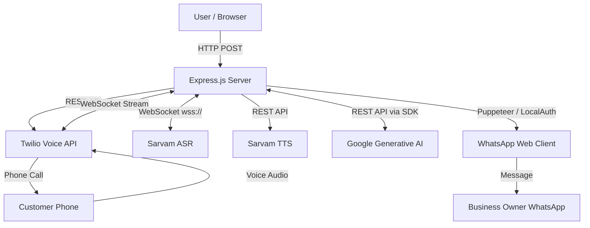
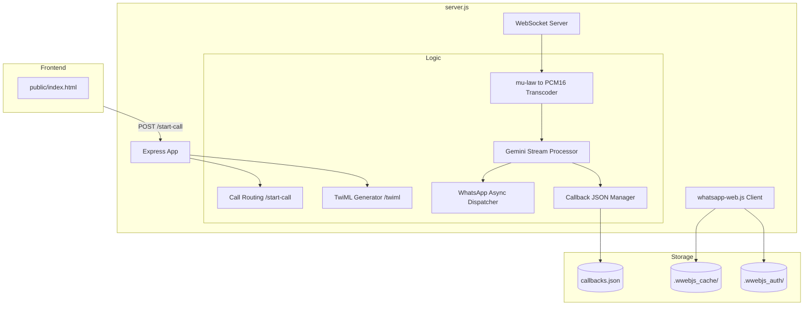
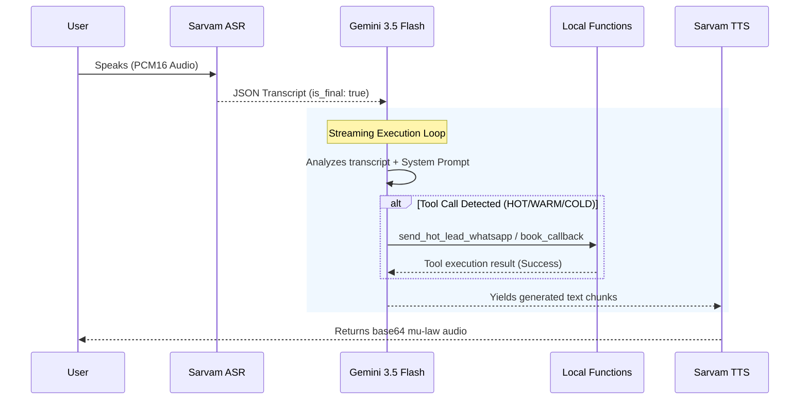

# System Architecture Documentation

This document provides a comprehensive technical architecture audit of the Autonomous AI Sales System, as implemented in the current repository.

---

## 1. High-Level System Architecture

The system is a monolithic Node.js application that bridges telephony (Twilio), real-time speech-to-text/text-to-speech (Sarvam AI), Large Language Models (Google Gemini), and messaging (WhatsApp).



---

## 2. Component Architecture

The repository is lightweight and does not use a traditional MVC separation. Most logic is contained within a single `server.js` file.



---

## 3. API Architecture

### HTTP Endpoints

| Method | Route | Purpose | Authentication | Handler |
| ------ | ----- | ------- | -------------- | ------- |
| `POST` | `/start-call` | Initiates an outbound Twilio call | None | Express inline function |
| `POST` | `/twiml` | Returns XML instructions to Twilio | None | Express inline function |

**`/start-call` details:**
- **Request Body:** `{ "to": "+919876543210" }` or `{ "phoneNumber": "+919876543210" }`
- **Data Access:** None
- **External Calls:** `twilioClient.calls.create()`
- **Side Effects:** Triggers a live phone call to the target number.

**`/twiml` details:**
- **Request Body:** Standard Twilio Webhook payload (`To`, `From`, etc.)
- **Response:** XML containing a `<Connect><Stream>` block pointing to the server's WebSocket.

### WebSocket Endpoints

| Route | Purpose | Protocol |
| ----- | ------- | -------- |
| `/ws` | Handles live bidirectional audio from Twilio | Twilio Media Streams API |

---

## 4. External Integrations

| Provider | Purpose | SDK/Library | Authentication | Behavior |
| -------- | ------- | ----------- | -------------- | -------- |
| **Twilio** | Telephony, making calls, passing audio | `twilio` (npm) | `TWILIO_ACCOUNT_SID` & `TWILIO_AUTH_TOKEN` | Sync REST call to initiate, async WSS for media. |
| **Sarvam AI (ASR)** | Speech-to-Text (Transliterated Hindi/English/Telugu) | Native `ws` | `SARVAM_API_KEY` (Header) | Streams raw PCM16 audio over WSS; returns JSON text. |
| **Sarvam AI (TTS)** | Text-to-Speech (Indian accents) | Native `fetch` | `SARVAM_API_KEY` (Header) | Sync REST call; returns base64 mu-law audio. |
| **Google Gemini** | Intent parsing, function calling, dialog generation | `@google/generative-ai` | `GEMINI_API_KEY` | Streaming REST response; handles conversational state. |
| **WhatsApp** | Mid-call alerts & post-call summaries | `whatsapp-web.js` | Local QR Code Scan (`.wwebjs_auth`) | Uses headless Puppeteer to control a web instance. |

---

## 5. AI / ML Execution Pipeline

The AI architecture operates dynamically within the WebSocket event loop.



**Key Pipeline Details:**
- **Model:** `gemini-3.5-flash`
- **Interrupts:** The pipeline implements a `callState.isInterrupted` boolean. If Sarvam ASR detects new speech mid-generation, the LLM stream and TTS promises are immediately halted to allow human barge-in.
- **Language Detection:** Handled dynamically via regex matching `[en-IN]`, `[hi-IN]`, or `[te-IN]` injected by Gemini based on system prompt instructions.
- **Post-Processing (Follow-up):** A *second* independent instance of Gemini 3.5 Flash is invoked after the call ends to summarize the raw transcript for the WhatsApp message.

---

## 6. Asynchronous Architecture & Data Flow

### The Twilio Media Stream Lifecycle
1. **Start:** Twilio connects to `/ws`. A unique `streamSid` is established.
2. **Media (Inbound):** Twilio sends base64 mu-law audio. 
   - *Transformation:* A custom JS bitwise function (`muLawToPcm16`) safely decodes mu-law to PCM16 binary and clamps values to prevent Node.js crashes (`ERR_OUT_OF_RANGE`).
3. **Processing:** PCM16 is piped to Sarvam ASR.
4. **Media (Outbound):** Sarvam TTS returns base64 mu-law, which is sent back over the WebSocket to Twilio.
5. **Stop:** Call ends. Triggers the async `send_post_call_whatsapp` workflow.

### Background Workers
- **WhatsApp Dispatcher:** Operations like `sendWhatsAppAsync` do not block the event loop. If the WhatsApp client is not yet authenticated (`!isWaReady`), messages are queued using an event listener (`waClient.once('ready', ...)`).

---

## 7. Database Architecture

There is no dedicated RDBMS or NoSQL database.

- **Persistence Layer:** A local JSON file (`callbacks.json`).
- **Schema:**
  ```json
  {
    "phoneNumber": "+919876543210",
    "scheduledTime": "2026-08-23T09:00:00.000Z",
    "barrier": "Wants to talk to wife first",
    "bookedAt": "2026-08-22T08:00:00.000Z"
  }
  ```
- **Access Pattern:** Read/Write happens synchronously via `fs.readFileSync` and `fs.writeFileSync`. 
- **Limitation:** Susceptible to race conditions if multiple concurrent calls attempt to book a callback at the exact same millisecond.

---

## 8. Frontend Architecture

- **Framework:** Vanilla HTML/CSS/JS (`public/index.html`).
- **Styling:** Custom CSS with CSS variables for theming.
- **State Management:** DOM-based. Button disabled states and simple text updates based on `fetch` response.
- **API Communication:** Standard browser `fetch()` API calling `POST /start-call`.

---

## 9. Security & Environment Configuration

### Authentication
- **User Authentication:** None. The web interface is public.
- **Twilio Webhook Authentication:** None. The `/twiml` endpoint is open to the internet.
- **WhatsApp Authentication:** Local session persistence via QR code scanning.

### Environment Variables
Managed via `dotenv`. 
- `PORT`
- `TWILIO_ACCOUNT_SID`, `TWILIO_AUTH_TOKEN`, `TWILIO_PHONE_NUMBER`
- `NGROK_URL` (Used dynamically to build the WebSocket URL)
- `SARVAM_API_KEY`
- `GEMINI_API_KEY`
- `TARGET_WHATSAPP_NUMBER`
- `MY_PHONE_NUMBER`
- `RESUME_URL`, `DIAGRAM_IMAGE_URL`
- `CHROME_BIN` (Added for Linux deployment compatibility)

*(Secret values are strictly maintained outside the codebase).*

---

## 10. Technical Debt & Architecture Risks

| Issue | Evidence | Impact | Severity | Suggested Direction |
| ----- | -------- | ------ | -------- | ------------------- |
| **Missing Webhook Validation** | `/twiml` does not verify the Twilio signature. | Anyone can POST to `/twiml` and generate arbitrary TwiML. | High | Implement `twilio.webhook()` middleware. |
| **Public Outbound API** | `/start-call` has no rate limiting or auth. | Malicious users can drain the Twilio account balance. | High | Add rate limiting and basic authentication. |
| **File DB Race Conditions** | `fs.writeFileSync` used in `callbacks.json`. | Concurrent calls booking meetings could overwrite the file. | Medium | Move to SQLite or MongoDB. |
| **Puppeteer Overhead** | `whatsapp-web.js` runs a full Chromium instance. | High RAM usage (~300-500MB). Difficult to run on serverless (e.g., Vercel). | Medium | Keep on VPS/Railway, or migrate to official WhatsApp Cloud API. |
| **Global State** | `isWaReady` and `waClient` are global. | Difficult to scale horizontally across multiple instances. | Low (for now) | Accept single-instance limitation or decouple WhatsApp worker. |

---

## 11. Scalability Analysis

The system is currently designed as a **Single-Instance Stateful Service**.

- **WebSockets:** Keep the connection bound to a single server instance.
- **WhatsApp Web:** Requires a persistent file system for `.wwebjs_auth` and cannot be easily load-balanced across multiple nodes without sticky sessions and shared volumes.
- **Throughput:** Node.js can handle hundreds of concurrent WebSocket connections, but the bottleneck will be CPU usage for processing multiple concurrent Gemini streaming responses, and Puppeteer RAM usage.
- **Horizontal Scaling:** **Not currently possible** without significant re-architecture (moving WhatsApp to a separate microservice and using a Redis pub/sub layer for WebSocket routing).

---

## 12. Deployment Configuration

The application is deployed as a standard Node.js process.
- **Entry point:** `node server.js`
- **Dependencies:** Requires a Linux environment with Chromium installed (referenced via `process.env.CHROME_BIN` for platforms like Render/Railway).
- **Network:** Requires a public-facing URL (handled via `NGROK_URL` locally) to receive Twilio webhooks.

---

## System Summary

The Autonomous AI Sales System is a highly responsive, single-node application that successfully integrates multiple real-time APIs to simulate a human sales engineer. It leverages a robust WebSocket pipeline to handle duplex audio, uses advanced LLM prompt engineering for intent classification and tool execution, and utilizes a local Puppeteer instance for rich WhatsApp integration. While architecturally sound for a prototype or single-server deployment, its reliance on local file storage and headless browsers limits its ability to scale horizontally.
