# System Architecture: Autonomous AI Sales Agent

Below is the high-level architecture diagram representing the real-time data flow, chunked streaming pipeline, and tool execution engine running inside your `server.js` file. 

This diagram illustrates how audio is bridged from a standard phone call, transcoded and processed by the AI engines in real-time, and how the LLM autonomously triggers the native WhatsApp browser to dispatch messages.

```mermaid
flowchart LR
    %% Professional Styling Palette
    classDef user fill:#1f2937,stroke:#111827,stroke-width:2px,color:#f9fafb,rx:10px
    classDef gateway fill:#2563eb,stroke:#1d4ed8,stroke-width:2px,color:#eff6ff,rx:5px
    classDef core fill:#059669,stroke:#047857,stroke-width:2px,color:#ecfdf5,rx:5px
    classDef ai fill:#7c3aed,stroke:#6d28d9,stroke-width:2px,color:#f5f3ff,rx:5px
    classDef whatsapp fill:#16a34a,stroke:#15803d,stroke-width:2px,color:#f0fdf4,rx:5px

    %% Actors
    Customer((📞 Customer Phone)):::user
    Owner((📱 Your WhatsApp)):::user

    %% Edge Gateway
    Twilio["Twilio Voice API<br/>(PSTN Gateway)"]:::gateway
    
    %% Internal Server Logic
    subgraph "Node.js Server (server.js)"
        direction TB
        WS["WebSocket Server"]:::core
        Transcoder["Binary Transcoder<br/>(mu-law ↔ PCM16)"]:::core
        Controller["Streaming LLM Controller<br/>(Chunking & Sequencing)"]:::core
        Tools["Intent Executor<br/>(Hot/Warm/Cold Functions)"]:::core
    end

    %% External AI Models
    subgraph "AI Inference Engines"
        direction TB
        ASR["Sarvam ASR<br/>(Live Speech-to-Text)"]:::ai
        Gemini["Gemini 3.5 Flash<br/>(Brain & Tool Calling)"]:::ai
        TTS["Sarvam TTS<br/>(Text-to-Speech)"]:::ai
    end

    %% WhatsApp Background Process
    WA["whatsapp-web.js<br/>(Headless Chromium Browser)"]:::whatsapp

    %% Audio Ingress/Egress Flow
    Customer <--> |Cellular Audio| Twilio
    Twilio <--> |Bidirectional WebSocket| WS
    WS --> Transcoder
    Transcoder --> |Raw Audio Buffer| ASR

    %% Cognitive Processing Flow
    ASR --> |Parsed Transcript| Controller
    Controller --> |Conversation History| Gemini
    Gemini -.-> |Live Word Stream| Controller
    Controller --> |Sliced Sentences| TTS
    TTS --> |Synthesized Audio| WS

    %% Autonomous Tool Execution
    Gemini --> |JSON Function Calls| Tools
    Tools --> |Mid-Call Triggers| WA
    Controller --> |Post-Call Summaries| WA

    %% Final Output
    WA --> |Encrypted Messaging| Owner
```

### Flow Breakdown
1. **The Ingress Loop:** Twilio bridges the cellular phone call to the Node.js WebSocket. The server transcodes the audio to PCM16 and streams it to the Sarvam ASR.
2. **The Cognitive Loop:** When the user stops talking, the transcript hits Gemini. As Gemini generates its response, the `Streaming LLM Controller` intercepts the words, chunks them into sentences, and fires them to the Sarvam TTS in parallel to eliminate latency.
3. **The Execution Loop:** If Gemini decides the user is Hot, Warm, or Cold, it skips text generation and issues a Function Call. The `Intent Executor` intercepts this, formats the required data, and pushes it to the `whatsapp-web.js` background browser which silently delivers the message to your phone.
